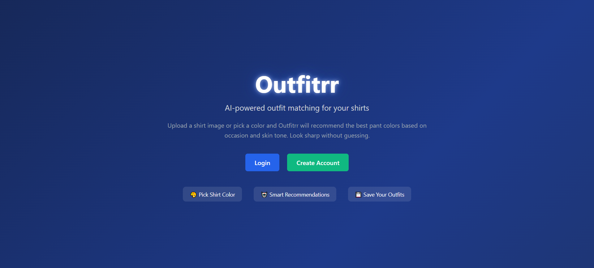
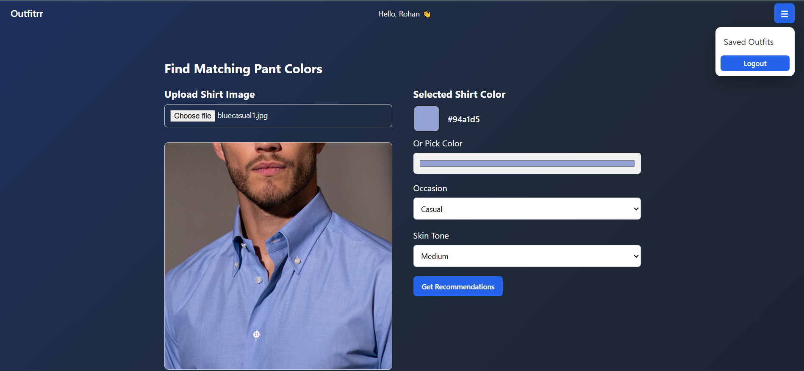
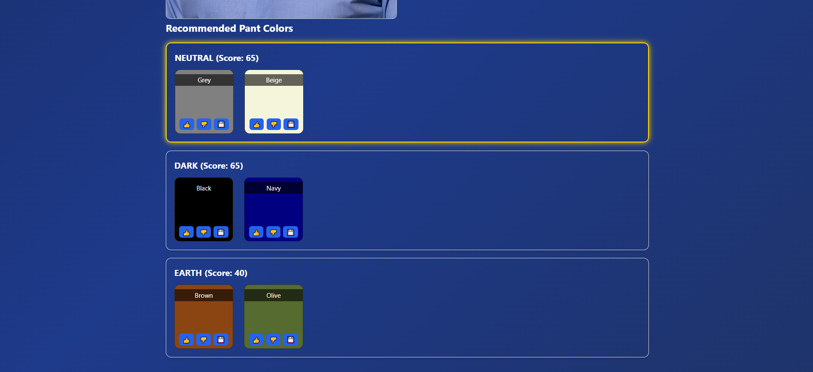

# Outfitrr
Rule-based outfit recommendation web app using Angular and Spring Boot

# Outfitrr – AI Outfit Recommendation Web App

Outfitrr is a full-stack web application that intelligently recommends matching pant colors based on a selected shirt color, occasion, and skin tone.

---

## Features

-  Pick shirt color via image upload or color picker
-  Smart pant color recommendations based on color categories
-  Feedback system to improve suggestions
-  Save outfits for later
-  Secure authentication using JWT
-  Personalized experience with user login

---

## Tech Stack

### Frontend
- Angular (Standalone Components)
- HTML, CSS

### Backend
- Spring Boot
- REST APIs
- JWT Authentication

### Database
- MySQL

---

## Screenshots

### Front Page


### Login Page


### Registeration Page


### Home Page


### Recommendation


### Saved Outfits


---

## How It Works

1. User selects a shirt color (image or picker)
2. Backend analyzes color category
3. Matching pant colors are suggested
4. User can like/dislike recommendations
5. Outfits can be saved and viewed later

---

## Setup Instructions

### Backend

```bash
cd Outfitrr
mvn spring-boot:run
```
### Frontend
```bash
cd outfitrr
npm install
ng serve
```

---

## Future Improvements
- AI-based learning from user feedback
- Outfit preview with images
- Mobile responsive UI enhancements

---

## Author
- Rohan B Lal
